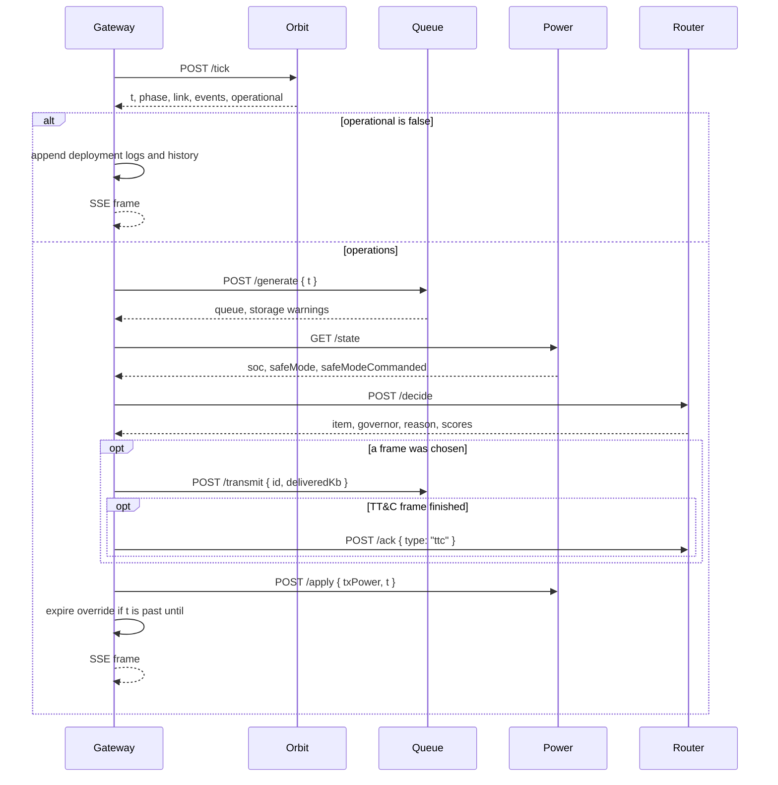

# Control loop

The gateway is the only process that advances time. This page is the order of calls inside one tick, then the rules the router applies.

Source: `services/gateway/server.js` and `services/router/policy.js`.

## Tick



Details that matter in a talk:

- **Deployment does no routing.** Until commissioning completes, the queue does not grow and the battery model does not run. The event log is the deployment checklist.
- **Generate, then decide.** A frame created this second is eligible this second.
- **Power is read before the choice and updated after the transmission.** The score and the safe-mode rule see the battery you had at the start of the second.
- **Transmit power is the mode’s `powerW` for the whole second**, including a second that only partially drains a frame. Idle seconds still pay the 0.22 W bus load inside `/apply`.
- **Loss of signal is logged with the queue depth from the previous second**, before this second’s new frames are added.
- **A failed downstream call skips the rest of that tick.** The interval keeps firing.

## Score

For each queued frame, if SNR is at least that mode’s `minSnr`:

```
priority = class weight of the mode
urgency  = clamp(ageSeconds / 60, 0, 1)
margin   = snr − minSnr
link     = clamp((margin + 2) / 10, 0, 1)
power    = clamp(1 − (powerW / rateKbps) / 0.35, 0, 1)

score = 0.40·priority + 0.25·urgency + 0.25·link + 0.10·power
```

Class weights: TT&C 1.00, SSTV 0.55, M17 0.40, Codec2 0.35.

The UI shows the four weighted terms (`0.40·priority`, and so on), not the raw 0–1 factors. The reason string names the winner, the runner-up, the score gap, and the SNR.

Frames under their SNR floor are not candidates. They stay in the queue and appear in the table without a score.

## Guard rails

`decide()` returns on the first match.

| Order | Governor id | Condition | Result |
| --- | --- | --- | --- |
| 1 | `link` | SNR ≤ 1.0 dB | Send nothing. Reason: below the TT&C floor. |
| 2 | `operator` | Gateway override is set and a frame of that mode exists | Send that frame. Score is still computed so the panel can show it. |
| 3 | `safe-mode` | `safeMode` is true | TT&C if one is queued, otherwise hold. |
| 4 | `watchdog` | `linkSinceTtc` > 30 and a TT&C frame exists | Force TT&C. The router reports `watchdogTripped` once per silence, not every second. |
| 5 | `policy` | At least one feasible frame | Highest score. Tie goes to whichever sort left first; equal scores show a `+0.00` gap. |
| 5b | `link` | Nothing feasible | Hold. Reason includes the SNR. |

If the override names a mode that is not in the queue, rule 2 does not match and later rules run. An operator cannot transmit a frame that does not exist.

The watchdog counter increases only while SNR is above 1 dB. Time below the horizon does not count. It resets when a TT&C frame’s `remainingKb` hits zero, which can take several seconds because housekeeping is only 1.2 kbps.

## Worked example

Pass just acquired, SNR 2.5 dB, SoC 80%, no override, TT&C and SSTV both queued.

- Rule 1 does not fire (2.5 > 1.0).
- Rule 2 does not fire.
- Rule 3 does not fire.
- Rule 4 does not fire if TT&C completed recently.
- SSTV’s floor is 9 dB, so it is not feasible.
- Policy selects TT&C, the only feasible frame, and the reason says so.

Later in the same pass, SNR 12 dB. SSTV becomes feasible. It still loses to a young TT&C frame on priority (0.40 × 1.00 versus 0.40 × 0.55) unless the image has been waiting long enough for the urgency term to close the gap, or the operator forces SSTV.

## Commands inside the loop

Overrides and safe mode are read on the **next** `POST /decide` after the uplink, except that the command response itself already updates the snapshot the browser is holding. The radio mode on the air changes when the following tick reaches the router.

| Input | Visible effect |
| --- | --- |
| Force mode | `override` on the snapshot immediately. `governor: "operator"` on a later tick that has a matching frame and a usable link. Cleared when `t > until` (25 s after the uplink second). |
| Safe mode | Power latch stays set across ticks. Recovery above 38% does not clear it. |
| Resume autonomy | Override null, latch clear, policy allowed again. |
| Capture SSTV | New queue row before the next tick. It will not transmit until SNR ≥ 9 dB and it wins, or until it is forced. |
| Reset | `t` returns to 0, phase deployment, empty queue, 78% SoC, logs replaced by the stowed-in-pod line. |

## What “delivered” means

`stats.framesDown` increments when a frame finishes, not when a second of it is sent. `stats.bitsDown` increments every transmitting second by `rateKbps × 1000`. `delivered` counts finished frames per mode. Those are the numbers on the dashboard counters and the SSTV strip.
