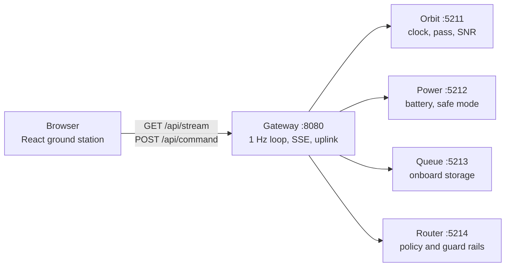
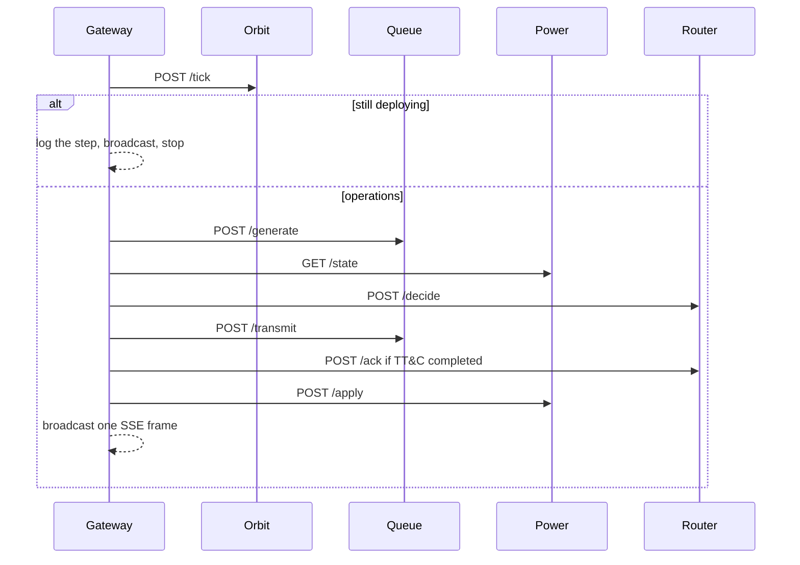

# Presentation outline

Suggested talk: **SomaiyaSat & SomaiyaPod — from a single simulator to a microservice ground segment**.

Fourteen slides. Each block below is one slide: a title, the words that belong on the slide, then what to say. Diagrams are Mermaid; paste them into a slide tool that renders Mermaid, or redraw the boxes.

Mission id: **KJS-SRS-01**. Collaborator named on the site: ReOrbit, Finland. The software is a demonstration. Orbit time, link budget, and battery drain are compressed so a deployment and several passes fit in a few minutes. It is not a live spacecraft feed.

---

## 1. Title

**On the slide**

- SomaiyaSat & SomaiyaPod
- PocketQube mission with an autonomous data router
- KJS-SRS-01 · Space Technology and Remote Sensing
- Ground segment implemented as microservices

**Say**

SomaiyaSat is a 5 cm PocketQube. SomaiyaPod is the deployer that releases it. After release, the spacecraft has one radio, a sub-1 W average power budget, and a short pass over a ground station. Something onboard has to decide, every second, whether to send housekeeping, digital voice, or an image. This talk is about the software that demonstrates that decision, and about splitting that software into services that match the spacecraft.

---

## 2. The constraint

**On the slide**

- 5 cm bus, average power under 1 W
- One shared RF chain, four modes
- Low Earth Orbit: short visibility windows
- Manual scheduling does not fit inside a pass

| Mode | Role | Rate | SNR floor | Transmit power |
| --- | --- | --- | --- | --- |
| TT&C | Health and command | 1.2 kbps | 1.0 dB | 0.35 W |
| Codec2 | Low-rate digital voice | 3.2 kbps | 4.0 dB | 0.55 W |
| M17 | Voice and data | 9.6 kbps | 6.0 dB | 0.8 W |
| SSTV | Image downlink | 16 kbps | 9.0 dB | 1.1 W |

**Say**

Higher-rate modes need a stronger link, which only exists near the middle of a pass. TT&C is slow but closes almost as soon as the satellite is above the horizon. The router’s job is to spend each second of the pass on the frame that is both important and actually receivable, without draining the battery or going silent.

---

## 3. What the application is

**On the slide**

Two products, one repository:

1. **Mission site** — problem, objectives, architecture, payload modes, workflow, AI governance, and the KJSIT / KJSSE program map.
2. **Ground station** — a live simulation. The routing line on screen is computed on the server every second and pushed to the browser. It is not a scripted animation.

Routes: `/`, `/mission`, `/architecture`, `/program`, `/dashboard`.

**Say**

The public pages explain the use case. The dashboard is the proof. Open it and the phase, SNR, battery, queue, and the reason for the current mode all move because a control loop is running.

---

## 4. Two ways the same loop is packaged

**On the slide**

| | Monolith | Microservice clone |
| --- | --- | --- |
| Where | `frontend/` + `backend/` | `microservices/` |
| Processes | 1 API + the UI | 4 domain services + gateway + UI |
| UI port | 5180 | 5181 |
| API port | 5175 | 8080 |
| Deploy target | Vercel (`vercel.json`) | Local Node or Docker Compose |
| Browser API | `/api/stream`, `/api/command` | Same paths |

**Say**

The clone does not replace the Vercel site. It is a second implementation of the same mission, split so each spacecraft concern can be explained, restarted, and health-checked on its own. The dashboard client did not have to change: it still opens an event stream and posts commands to `/api`.

---

## 5. Service map

**On the slide**



**Say**

The browser never calls orbit, power, queue, or the router directly. The gateway is the ground segment’s single front door. Behind it, each box owns one kind of state. Orbit does not know the battery. The router does not store frames. Power does not invent SNR.

There is no database and no message broker. State lives in the process that owns it. Services talk over HTTP because the loop has one writer and a fixed order. A queue in the middle would not change who owns the data.

---

## 6. Who owns what

**On the slide**

| Service | State it is allowed to change |
| --- | --- |
| Orbit | Mission time, deployment phase, pass clock, elevation, SNR |
| Power | State of charge, eclipse, safe-mode latch |
| Queue | Frame list, remaining bytes, storage overflow |
| Router | Seconds of usable link since the last TT&C frame, watchdog latch |
| Gateway | Override timer, event log, decision log, the picture sent to the UI |

**Say**

That split is the design. A command from the ground does not broadcast into every service. Forcing a mode for 25 seconds stays on the gateway. Safe mode is a power-service latch. Scheduling an SSTV capture is a queue write. Reset is the only command that clears all five.

---

## 7. One simulated second

**On the slide**



**Say**

Time moves only when the gateway asks orbit to tick. During the first 30 mission seconds the spacecraft is still leaving SomaiyaPod, so the loop stops after orbit. After commissioning, the gateway generates traffic, reads last tick’s battery, asks for a decision, ships one second of the winning waveform, then charges or discharges the battery. Safe mode entered on this tick applies on the next tick. That ordering is what makes the guard rails predictable.

---

## 8. The score

**On the slide**

```
score = 0.40·priority + 0.25·urgency + 0.25·link + 0.10·power
```

| Term | Meaning |
| --- | --- |
| Priority | TT&C 1.00, SSTV 0.55, M17 0.40, Codec2 0.35 |
| Urgency | Age of the frame, saturated at 60 s |
| Link | SNR margin above that mode’s floor |
| Power | Penalty for joules per delivered kilobit |

A mode below its SNR floor is removed before scoring.

**Say**

This is the “learned policy” stand-in: a small weighted score, the kind of compact model that fits a PocketQube. Every term is logged. The ground station draws the breakdown, so a choice can be explained after the pass. Point at the decision panel while you say this.

---

## 9. Guard rails before the policy

**On the slide**

Evaluated in this order, and the first match wins:

1. **Link floor** — SNR at or below 1 dB: send nothing.
2. **Operator** — an uplink is active: send that mode if a frame exists.
3. **Safe mode** — commanded, or SoC under 25%: housekeeping only. Auto-clear above 38% if the operator did not latch it.
4. **Watchdog** — 30 seconds of usable link with no completed TT&C frame: force housekeeping.
5. **Policy** — otherwise take the highest feasible score.

**Say**

The model is not allowed to talk the spacecraft into silence. Rules run first. The watchdog counts usable link time, not time spent below the horizon, so a long loss-of-signal gap does not by itself trip it. The dashboard badge shows which rule won: link, operator, safe mode, watchdog, or policy.

---

## 10. Uplink

**On the slide**

| Button | Effect | Where it lands |
| --- | --- | --- |
| Force TT&C / Codec2 / M17 / SSTV | That mode for 25 mission seconds | Gateway override |
| Safe mode | Housekeeping only, latched | Power service |
| Resume autonomy | Clear override and safe mode | Gateway and power |
| Capture SSTV | Queue a large image frame | Queue service |
| Reset | Clear every service and the log | All five |

**Say**

Human-in-the-loop is an uplink, not a person sitting inside the router. Autonomy resumes when the override expires or when the operator clears it. Click one force button during the demo and wait for the badge to change to operator, then either wait 25 seconds or hit resume.

---

## 11. Technology stack

**On the slide**

| Layer | Choice |
| --- | --- |
| UI | React 18, React Router 7, Vite 5, Tailwind 3 |
| Live updates | Server-sent events (`EventSource` on `/api/stream`) |
| Services | Node.js, ES modules, Express 4 |
| Contract | JSON over HTTP inside the cluster; one public `/api` outside |
| Packaging | `npm start` on the host, or Docker Compose with one container per service |
| Persistence | None. Restarting a service resets the state it owns. |

**Say**

SSE fits a one-way telemetry stream: the server pushes a frame each simulated second, and the page does not poll. Commands are ordinary POST requests. Express is enough because each service is a small state machine with a handful of routes. Compose is how you show the process boundary in a talk: five listeners, five health checks.

---

## 12. What the dashboard is reading

**On the slide**

One JSON frame per second. The panels are projections of that frame:

- Phase, clock, pass geometry, SNR, SoC, eclipse
- Current mode and the governor that chose it
- Score terms, queue with per-item scores
- Event log, decision log, SSTV strip, delivery counters

`GET /api/health` adds a line per downstream service: `ok` or `down`.

**Say**

If you stop the power process, the gateway health goes degraded and the next tick fails closed for that second. The UI does not have a private channel into the battery. That is the point of the gateway: one snapshot, assembled after the loop, not five partial views racing each other.

---

## 13. Demo beats

**On the slide**

1. Home → mission site in one sentence.
2. Architecture page → the spacecraft block diagram.
3. Ground station → wait out the 30 s deployment, or reset and narrate the steps.
4. At acquisition of signal, watch the mode follow SNR: idle, then TT&C, then Codec2 or M17, SSTV only when the margin clears 9 dB.
5. Force a mode. Then safe mode. Then resume.
6. Optional: `GET /api/health` and show four services plus the gateway.

Full click path: [demo script](demo.md).

**Say**

Do not rush the first pass. The interesting moment is the mode change as elevation climbs, with the score breakdown updating beside it. That is the slide 8 formula running for real.

---

## 14. Close

**On the slide**

- Same mission, two deployments: one process for the public site, five processes when the talk is about architecture.
- Boundaries follow the vehicle: orbit, power, storage, router, ground.
- Decisions stay explainable: weights, guard rails, and a log line for every second.
- Next place to go deeper: swap the weighted score for a small model behind `POST /decide` without touching the UI.

**Say**

The microservice split is not there to add servers. It is there so the autonomy story and the software story use the same boxes. Orbit tells you the link. Power tells you what you can afford. The queue tells you what is waiting. The router is the only place a policy is allowed to choose. The gateway is the ground team.

---

## Appendix — numbers worth memorising

- Tick: 1 simulated second = 1 wall-clock second.
- Deployment: 30 s, then about 8 s until the first pass.
- Pass length: 200 s. Gap between passes: 70 s.
- Battery: 3.2 Wh, start at 78% SoC. Eclipse is about 36% of the orbit sinusoid.
- Onboard storage: 40 frames. If it fills, the oldest non-TT&C frame is overwritten.
- Housekeeping is generated every 10 s. An SSTV frame is generated every 75 s. Voice traffic is random.
- Policy weights: 0.40 / 0.25 / 0.25 / 0.10.
- Safe mode: enter at 25% SoC, leave at 38% unless the operator latched it.
- Watchdog: 30 s of usable link without a completed TT&C frame.
- Operator override: 25 s.
