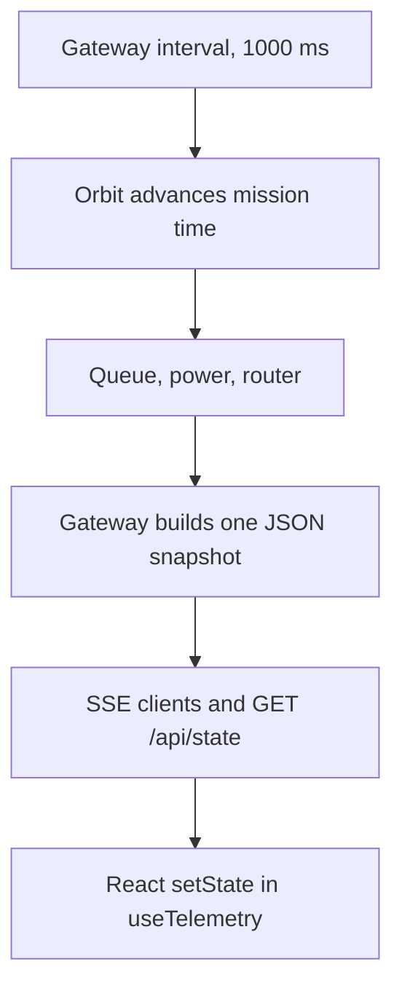

# Stack

This is the concrete toolchain behind the slides in [presentation.md](presentation.md).

## Repository layout

```
frontend/                 React mission site + ground station (monolith UI)
backend/                  One Express process: orbit, power, queue, router, SSE
api/                      Vercel functions that call the same backend runtime
vercel.json               Builds frontend/ and mounts api/ at /api

microservices/
  shared/config.js        Modes, weights, orbit timing, battery constants
  shared/http.js          JSON helper used by the gateway
  services/orbit          Pass geometry and deployment
  services/power          Battery and safe mode
  services/queue          Onboard frame storage
  services/router         Scoring policy and guard rails
  services/gateway        Public API and the 1 Hz orchestrator
  web/                    Copy of the React app, pointed at the gateway
  start.mjs               Spawns all five Node processes
  docker-compose.yml      One container per service, plus the UI
  docs/                   These notes
```

`shared/config.js` matches `backend/src/config.js`. The clone scores, powers, and times the spacecraft the same way as the monolith. Random fading and random traffic mean two runs are not bit-identical.

## UI

| Piece | Role |
| --- | --- |
| React 18 | Pages and dashboard panels |
| React Router 7 | `/`, `/mission`, `/architecture`, `/program`, `/dashboard` |
| Vite 5 | Dev server and production build |
| Tailwind CSS 3 | Layout and the ground-station panels |
| `useTelemetry` | Opens `EventSource('/api/stream')` and `POST /api/command` |

The page never learns service hostnames. Vite proxies `/api` to the API process:

| App | Dev server | Proxy target |
| --- | --- | --- |
| Monolith `frontend/` | http://localhost:5180 | http://localhost:5175 |
| Clone `microservices/web/` | http://localhost:5181 | http://127.0.0.1:8080, or `API_PROXY` in Docker |

Content for the mission pages is static data in `web/src/data/mission.js` (same source as `frontend/src/data/mission.js`). Only the dashboard is live.

## Services

Every service is a Node.js ES module (`"type": "module"`) using Express 4 and JSON bodies. Node 22 is the version this repo is developed against. There is no shared database. Each process keeps its state in memory and exposes:

- `GET /health`
- `POST /reset`
- the routes listed in [services.md](services.md)

The gateway adds CORS and is the only process bound to a public port in Compose (`8080`). Orbit, power, queue, and router stay on the Compose network.

| Process | Host port | Compose DNS |
| --- | --- | --- |
| Orbit | 5211 | `http://orbit:5211` |
| Power | 5212 | `http://power:5212` |
| Queue | 5213 | `http://queue:5213` |
| Router | 5214 | `http://router:5214` |
| Gateway | 8080 | `http://gateway:8080` |
| Web | 5181 | proxies to the gateway |

`start.mjs` sets those URLs to `127.0.0.1`. The gateway reads `ORBIT_URL`, `POWER_URL`, `QUEUE_URL`, and `ROUTER_URL`.

## How a browser frame is produced



Server-sent events are a one-way stream: `Content-Type: text/event-stream`, one `data:` record per tick. The dashboard does not poll `/api/state` while the stream is open. A command response also includes `state`, so the panel updates immediately instead of waiting for the next tick.

The monolith only advances the simulation while a client is connected, or catches up on the next request. The gateway ticks continuously from startup so the five clocks stay aligned even if the browser disconnects.

## Why HTTP, and why no broker

The control loop is ordered. Safe mode and the watchdog must observe the previous second’s power and link, then the battery must update after the transmission. The gateway is the only writer of that sequence. HTTP calls make the order visible in the gateway source and in a sequence diagram.

A message bus would still need the same order and the same owners. It is not used here.

## Packaging

**Host.** From `microservices/`: `npm install` then `npm start`. In another terminal, `npm install --prefix web` and `npm run dev --prefix web`.

**Docker Compose.** `docker compose up --build` from `microservices/`. Backend services share one image (`Dockerfile`) and differ by command. The web image runs Vite with `API_PROXY=http://gateway:8080`. Orbit, power, queue, and router publish health checks; the gateway waits until those checks pass.

**Tests.** `npm test` in `microservices/` runs:

- unit tests for the score and the five guard-rail outcomes (`test/policy.test.js`)
- an integration test that boots all five processes on ports 5311–5314 and 8091, checks health, policy, force-mode, and reset (`test/integration.test.js`)

## What is intentionally out of scope

- No authentication on the demo API.
- No persistent log store. The gateway keeps the last 120 events, 60 decisions, and 240 history samples in memory.
- The Vercel deployment still builds the monolith. The Compose stack is the microservice runtime.
- Fading, traffic bursts, and max elevation are random. Narrate behaviour (mode follows SNR), not a specific score from a previous run.
